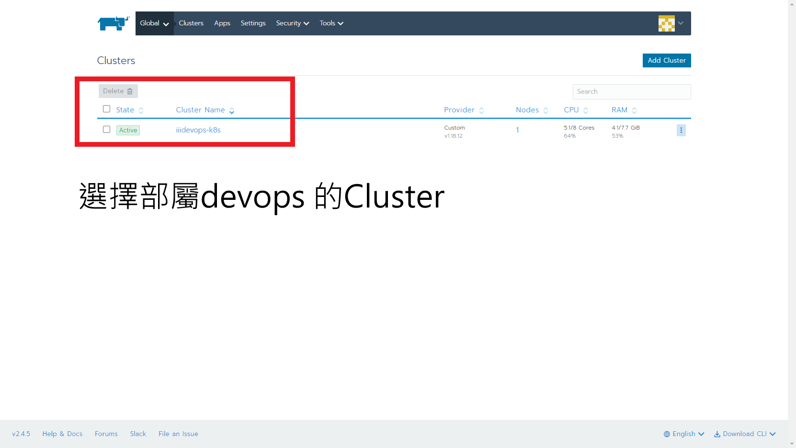
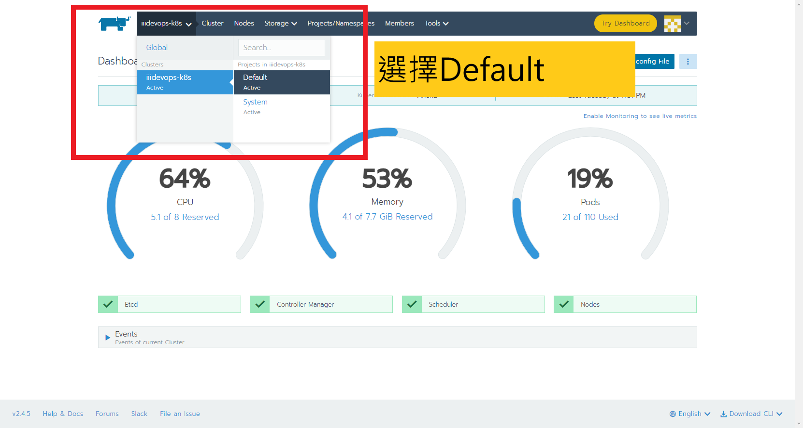
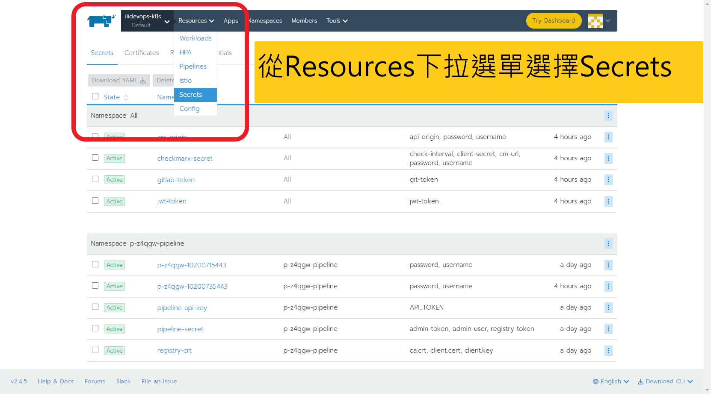
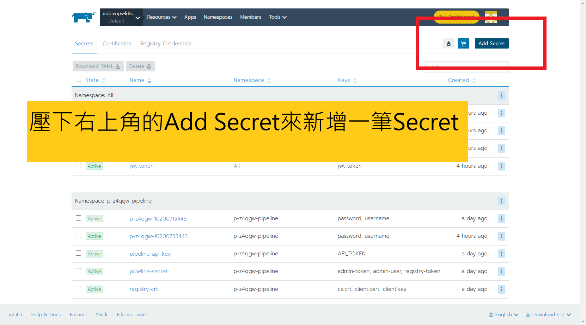
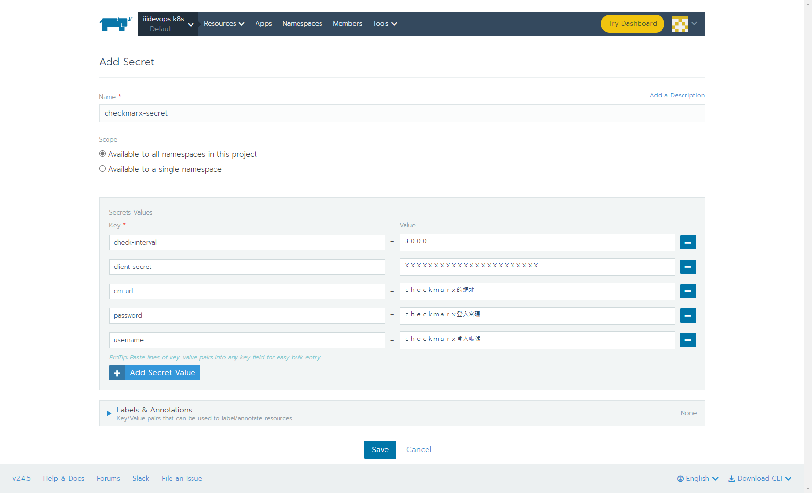
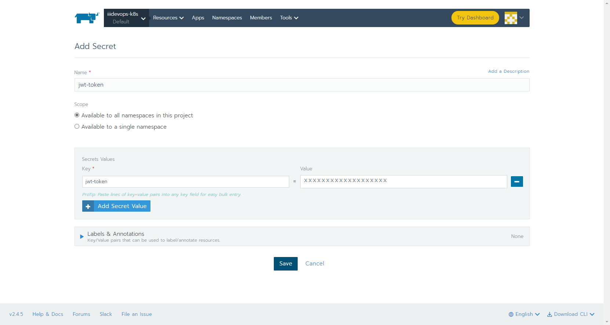
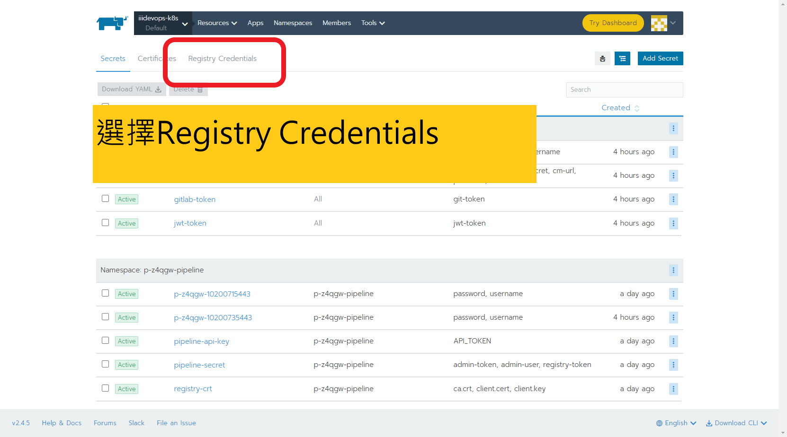
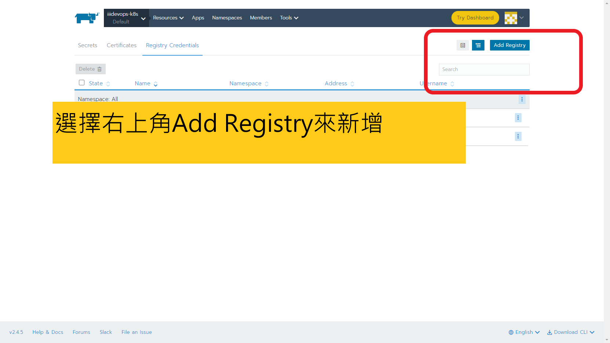

# How to enter page that manage secrets from rancher

# Add secrets for all namespace

## 接下來會需要此步驟(按鈕)來新增四個`Secret`
> Name: `api-origin`  
> Keys: `api-origin`、`password`、`username`  

> Name: `checkmarx-secret`  
> Keys: `check-interval`、`client-secret`、`cm-url`、`password`、`username`

> Name: `gitlab-token`  
> Keys: `git-token`

> Name: `jwt-token`  
> Keys: `jwt-token`

# Add Registry Credentials for all namespace

> Name: `harbor-63`

